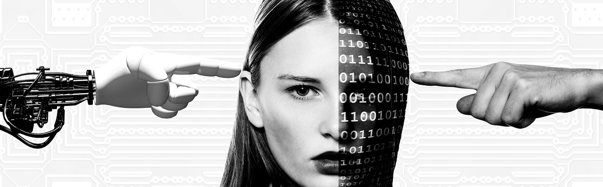

Plus qu’être imbattable pour effectuer une tâche de calcul mental, ou de jeu de Go, l’intelligence est la capacité d’un système vivant à comprendre, interpréter, apprendre et s’adapter aux changements.

**Être intelligent c’est savoir trouver la réponse la plus adaptée à une problématique**,  pour cela, on s’appuie sur l’ensemble de nos facultés mentales et cognitives. e plus, l’intelligence est incarnée, c’est quelque chose indissociable de notre corps. Si l’on reprend l’exemple du jeu de Go, on fait appel à son intellect pour adapter sa stratégie de jeu à une situation, anticiper celle de son adversaire et trouver la meilleure combinaison pour emporter la partie. Mais alors, si en 2016 le programme Alpha Go a réussi à battre le champion coréen du jeu de Go, cela veut-il dire que les programmes informatiques sont plus intelligents que l’intelligence humaine ?

Bref, **quelle différence entre l’intelligence d’un être humain et celle d’une machine**?

Si l’intelligence artificielle est très impressionnante, elle se limite toujours à un domaine bien défini. De plus elle n’est pas incarnée, contrairement à notre intelligence biologique incarnée dans un corps. Elle se base sur l’apprentissage et pour cela a besoin de faire des statistiques sur beaucoup de données, contrairement à notre intelligence qui peut faire des déductions pertinentes à partir de quelques exemples. Bien entendu la machine est capable d’effectuer des calculs et de traiter des informations à un rythme affolant, mais cette machine ne comprend pas la tâche que vous lui demandez d'exécuter. Par exemple, si vous demandez à un enfant de chercher l’image d’un chien dans un livre illustré, il suffira pour l’enfant de visualiser une ou deux images de chien pour ensuite pouvoir reconnaître l’animal, y compris dans une situation inhabituelle (de nuit, par exemple). L’enfant au-delà de visualiser ce à quoi un chien peut ressembler saura par la suite, le définir, le décrire, voire même évoquer de possibles liens affectifs qu’il aurait développés avec l’animal.
Un algorithme, lui, aura besoin de centaines de milliers de photos avant de reconnaître un chien sans se tromper. Par ailleurs, si vous lancez sur internet une recherche avec le mot “chien”, le moteur de recherche sera capable d’afficher des centaines de millions d’images de chien, sans pour autant savoir ce qu’est un chien, ni le définir, ni le décrire, ni expliquer comment il a pu ressentir une quelconque émotion vis-à-vis de lui.

L’intelligence humaine ou animale, l’intelligence biologique se base sur des capacités cognitives et aussi émotionnelles, en lien avec le corps. Une intelligence artificielle, dite “forte”, qui serait capable d’être autonome et polyvalente dans des situations inattendues est un objectif scientifique. Cependant, actuellement, il y a des résultats qui montrent que cet objectif idéal d'intelligence artificielle forte est techniquement impossible. Pour le moment, cela relève de la croyance, pas d’une future révolution scientifique.
