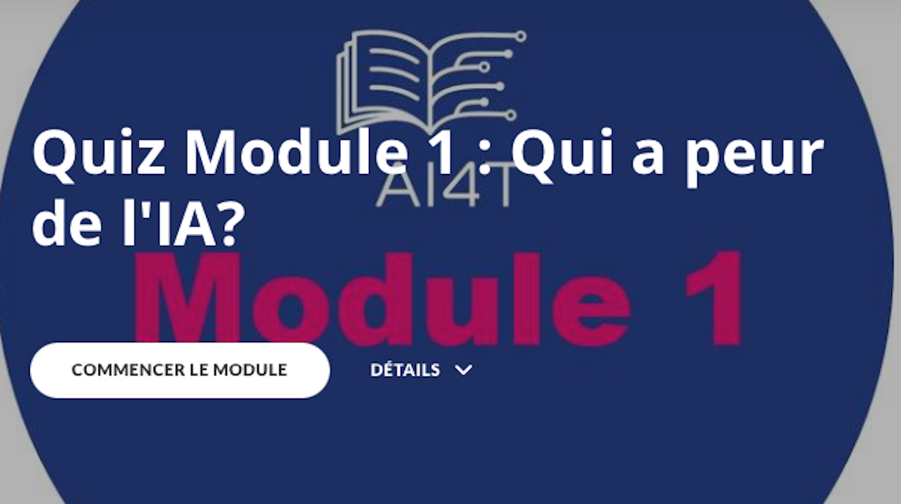

### QUIZ Module 1: Qui a peur de l'IA ?

Le Quiz du Module 1 est composé de 3 parties:

- QUIZ 1: Avez-vous dit IA ?
- QUIZ 2: Un peu d'histoire
- QUIZ 3: Différentes approches de l'IA

_Cliquez sur l'image ci-dessous et lancez le quiz !_

{:target="_blank" }
