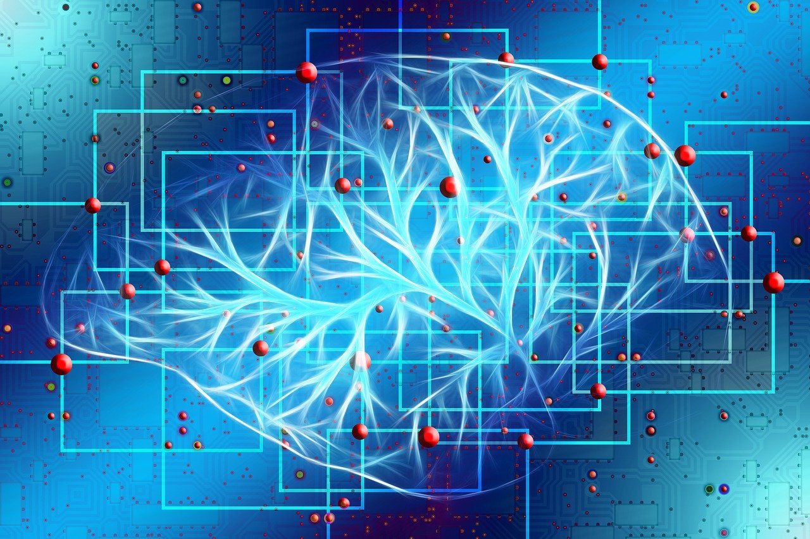

Beaucoup de mécanismes d’intelligence artificielle fonctionnent aujourd’hui par l’apprentissage supervisé. Ce mécanisme ressemble à l’une des manières d’apprendre d’un système biologique.

Imaginons que nous souhaitions apprendre à une intelligence artificielle à reconnaître un chat dans une image. Pour ce faire, on va fournir beaucoup de données, à savoir, beaucoup d’images où l’on aperçoit un chat et beaucoup d’images où l’on ne voit pas de chat pour que le calcul ajuste ses paramètres de manière à donner en sortie une valeur correspondant à la présence ou non du félin. Toutes ces images constituent les données d’entrée, et le résultat attendu, savoir s’il y a ou non un chat dans l’image, celles de sortie. Ces données “d’entrée” et de “sortie” sont les seules informations que l’on fournit pour son apprentissage.
Le mécanisme de calcul doit donc ajuster des paramètres internes (comme les boutons de réglage d’un appareil) pour déterminer s'il y a ou non un chat dans l’image. La première fois, un résultat au hasard et donc très probablement faux sera fourni, puis petit à petit le mécanisme observera les erreurs et par essais successifs va ajuster les paramètres pour les réduire. C’est ce processus que l’on nomme l’apprentissage automatique ou machine learning en anglais.

Image by Gerd Altmann from Pixabay

Ce mécanisme de réseau de neurones artificiels, est bien différent des neurones de notre cerveau : ce sont juste des unités de calcul élémentaires qui combinent des données en entrée et délivrent une valeur basse ou élevée en sortie selon la valeur combinée. Un réseau de neurones regroupe un ensemble de neurones tous liés et communicants entre eux. Ce sont les paramètres de ces connections entre neurones qui constituent les boutons de réglage pour obtenir la sortie souhaitée, pour une entrée donnée. Des neurones d’entrée aux neurones de sortie, en passant par les neurones internes au réseau (neurones cachés), l’information numérique est transmise pour donner un résultat final.

On parle d'**apprentissage profond, deep learning,** quand il y a beaucoup de couches cachées empilées, pour rendre le calcul plus efficace.

On parle de **"réseaux de neurones convolutifs"** quand les neurones regroupent l’information des autres neurones au voisinage avant de transmettre la sortie aux couches supérieures. Par exemple, lors de l’analyse d’une image, un réseau de neurones convolutif va créer des filtres pour regrouper l’information d’une petite zone de l’image. Par exemple le contraste, ou un élément de couleur, puis à la couche suivante des petites zones correspondant à des éléments de base comme un trait ou une zone un peu ronde, et petit à petit le mécanisme reconnaît un chat aussi bien que Philippe Geluck, c’est bluffant. Mais alors, quel raisonnement a-t-il été mis en place pour distinguer les images avec et sans chat ? Et bien, aucun ! C’est juste du calcul, un calcul aveugle en quelque sorte. Et on ne sait pas bien aujourd’hui interpréter un tel calcul. C’est ce qu’on appelle la boîte noire de l’IA2.

* * *
2_[Comprendre le DeepLearning et les Réseaux de neurones en 10 mins !](https://www.youtube.com/watch?v=gPVVsw2OWdM)_ vidéo, Sociamix, août 2019
_[Le deep learning](https://www.youtube.com/watch?v=trWrEWfhTVg)_, vidéo, Science étonnante #27, avril 2016  
_[Comment le « deep learning » révolutionne l'intelligence artificielle](https://www.lemonde.fr/pixels/article/2015/07/24/comment-le-deep-learning-revolutionne-l-intelligence-artificielle_4695929_4408996.html)_ par Morgane Tual ; Le Monde, juillet 2015.
