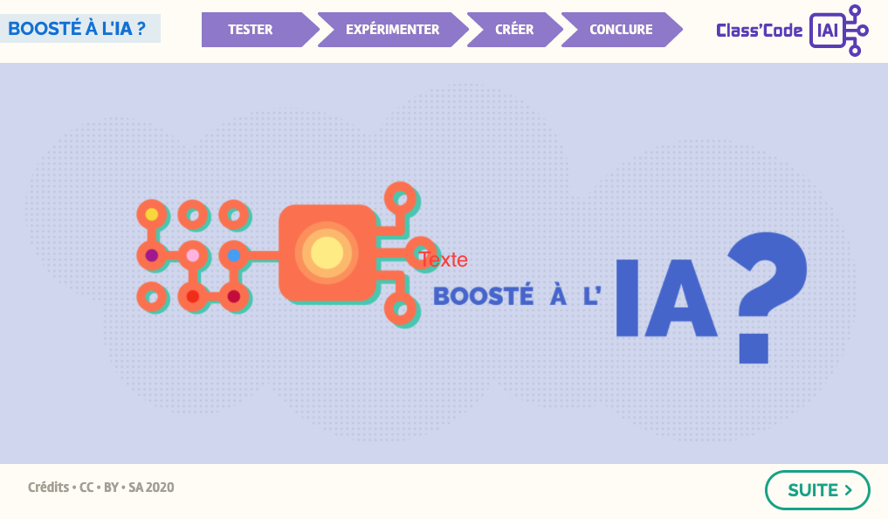

Il n'y a pas de meilleur moyen de comprendre le fonctionnement de l'apprentissage automatique et de la formation des programmes que de comprendre comment préparer correctement votre ensemble de données.

**A vous de jouer!**  
_Cliquez sur l'image ci-dessous et laissez-vous guider!_

{:target="_blank" }
