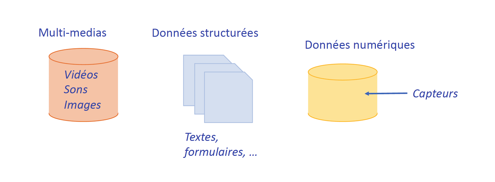
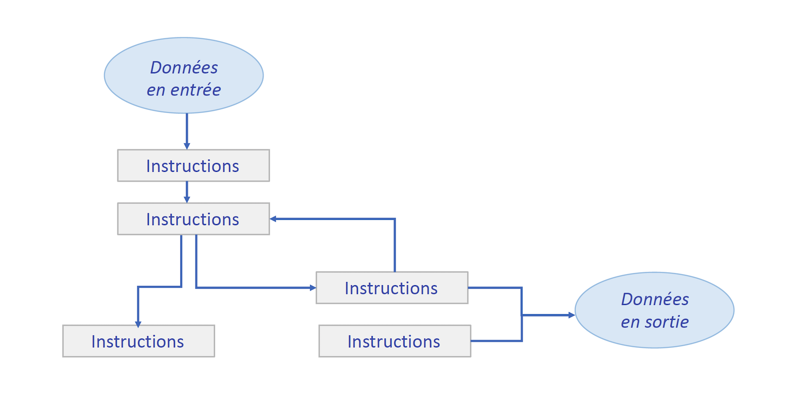

[Article publié le 20 Février 2020 par binaire sur le site du Monde : "D’où vient le risque ? Des données et des algorithmes" - _Autheurs: Serge Abiteboul, Thierry Viéville_](https://www.lemonde.fr/blog/binaire/2020/02/05/les-plateformes-numeriques-un-foyer-pour-les-risques-donnees-et-algorithmes/) 

_La rencontre de chercheurs juristes et informaticiens dans le cadre du lancement du [Centre Internet et Société](http://cis.cnrs.fr/)  et du montage du GdR Internet et Société, a été l'occasion de réflexions croisées et de soulever nombre de questions et premières pistes de recherche à explorer ensemble. Cet article résume le résultat d’une table ronde. **Serge Abiteboul, Thierry Viéville.**_

[Photo de Fernando Arcos pour Pexels](https://www.pexels.com/photo/white-caution-cone-on-keyboard-211151/?utm_content=attributionCopyText&utm_medium=referral&utm_source=pexels)

Classification des risques
-----------------------

Les plateformes numériques et leur rôle dans la société occupent les médias et les instances gouvernantes. Nous, juristes et informaticiens, les percevons comme des nouveaux marchés de la donnée.
Plusieurs acteurs humains, artistes, auteurs, créateurs de contenu, développeurs de langages, développeurs de plateformes, développeurs d’applications, internautes consommateurs,  acteurs publics et privés, gravitent autour de ces plateformes et sont exposés à **deux types de risque** :

*   Le **risque-données** se réfère à la protection des données sur ces plateformes.
*   Le **risque-algorithmes** se réfère aux dérives de discrimination algorithmique.

Ce document apporte une première réflexion sur comment appréhender les plateformes numériques et les risque-données et risque-algorithmes. Ces questions peuvent être abordées de deux points de vue complémentaires : le point de vue juridique dont le souci principal est de déterminer les cadres qui permettent d’identifier et de réguler ces risques, et le point de vue informatique dont le but est de développer les outils nécessaires pour quantifier et résoudre ces risques.

Les trois facettes du risque algorithmique.
------------------------------------

Le risque-algorithmes peut être caractérisé de 3 façons.

*   Il s'agit d'abord de l’**enfermement algorithmique** qui peut aussi bien porter sur les opinions, la connaissance culturelle, ou encore les pratiques commerciales. En effet, les algorithmes confrontent l’internaute aux mêmes contenus, selon son profil et les paramètres intégrés, en dépit du respect du principe de la loyauté. C’est le cas sur les sites de recommandation de news comme Facebook ou les sites de recommandation de produits comme Amazon.
*   La deuxième facette du risque-algorithmique est liée à la **maîtrise de tous les aspects de la vie d’un individu**, de la régulation de l’information à destination des investisseurs jusqu’à ses habitudes alimentaires, ses hobbies, ou encore son état de santé. Ce traçage de l’individu laisse présager l’emprise d’une forme de surveillance qui contrevient à l’essence même de la liberté de l’individu..
*   La troisième est liée à la potentielle **violation des droits fondamentaux**. En particulier, à la discrimination algorithmique définie comme le traitement défavorable ou inégal, en comparaison à d’autres personnes ou d’autres situations égales ou similaires, fondé sur un motif expressément prohibé par la loi. Ceci englobe l’étude de l’équité (_fairness_) des algorithmes de classement (tri de personnes cherchant un travail en ligne), de recommandation, et d’apprentissage en vue de prédiction. Le problème des [discriminatory bias](https://www.ted.com/talks/joy_buolamwini_how_i_m_fighting_bias_in_algorithms?language=fr) induits par des algorithmes concerne plusieurs domaines comme l’embauche en ligne sur MisterTemp’, Qapa et TaskRabbit, les décisions de justice, les décisions de patrouilles de police, ou encore les admissions scolaires.

Des risques aux biais sur les données et dans les algorithmes.
--------------------------------------------

Nous reprenons une [classification des biais](https://www.telecom-paris.fr/wp-content-EvDsK19/uploads/2019/02/Algorithmes-Biais-discrimination-equite.pdf) proposée par des collègues de Télécom ParisTech et discutée dans un [a rapport](https://www.institutmontaigne.org/blog/algorithmes-donnees-et-biais-quelles-politiques-publiques)de l’Institut Montaigne à Paris. Nous adaptons cette classification aux risque-données et risque-algorithmes en mettant l’accent sur les biais.

 
©Sihem Amer-Yahia

The data come from different sources and have multiple formats. They carry different types of bias.

Le biais-données est principalement statistique

*  Le **biais des données** est typiquement présent dans les valeurs des données. Par exemple, c'est le cas pour un algorithme de recrutement entraîné sur une base de données dans laquelle les hommes sont sur-représentés exclura les femmes.  
*  Le **biais de stéréotype** est une tendance qui consiste à agir en référence au groupe social auquel nous appartenons. Par exemple, une étude montre qu’une femme a tendance à cliquer sur des offres d’emplois qu’elle pense plus facile à obtenir en tant que femme.
*   Le **biais de variable omise** (de modélisation ou d’encodage) est un biais dû à la difficulté de représenter ou d’encoder un facteur dans les données. Par exemple, comme il est difficile de trouver des critères factuels pour mesurer l’intelligence émotionnelle, cette dimension est absente des algorithmes de recrutement.
*   Le **biais de sélection** est lui dû aux caractéristiques de l’échantillon sélectionné pour tirer des conclusions. Par exemple, une banque utilisera des données internes pour déterminer un score de crédit, en se focalisant sur les personnes ayant obtenu ou pas un prêt, mais ignorant celles qui n’ont jamais eu besoin d’emprunter, etc.

Le biais algorithmique tient principalement du raisonnement.

*   Un **biais économique** est introduit dans les algorithmes, volontairement ou involontairement, parce qu'il va être efficace économiquement. Par exemple, un algorithme de publicité oriente les annonces vers des profils particuliers pour lesquels les chances de succès sont plus importantes ; des rasoirs vont être plus présentés à des hommes, des fastfood à des populations socialement défavorisées, etc.

Il convient également de citer toute une palette de biais cognitifs

*   Les biais de conformité, dits du "mouton de Panurge", correspondent à  notre tendance à reproduire les croyances de notre communauté. C'est le cas, par exemple, quand nous soutenons un candidat lors d’une élection parce que sa famille et ses amis le soutiennent.            
*   Le biais de confirmation est une tendance à privilégier les informations qui renforcent notre point de vue. Par exemple, après qu’une personne de confiance nous a affirmé qu'untel est autoritaire, remarquer uniquement les exemples qui le démontrent.               
*   Le biais de corrélation illusoire est une tendance à vouloir associer des phénomènes qui ne sont pas nécessairement liés. Par exemple, penser qu’il y a une relation entre soi-même et un événement extérieur comme le retard d’un train ou une tempête..
*   Le biais d’endogénéité est lié à une relative incapacité à anticiper le futur. Par exemple, dans le cas du _credit scoring_, il se peut qu’un prospect avec un mauvais historique de remboursement d’emprunt puisse changer de style de vie lorsqu’il décide de fonder une famille.

  
©Sihem Amer-Yahia

Les algorithmes sont une série d’instructions qui manipulent des données en entrée et retournent des données en sortie. Ces données en entrée véhiculent parfois des biais. Les biais peuvent aussi se trouver dans une ou plusieurs instructions des algorithmes.

#### Doit-on aborder les risque-données et risque-algorithmes sur les plateformes numériques ensemble ou séparément ?

Considérons deux exemples, le contexte de la technologie blockchain, et celui des systèmes d’Intelligence Artificielle.

Sur la blockchain, l’on retrouve tout d’abord les données, les risques et leur biais. Prenons l’exemple des données et des risques associés. La blockchain fonctionne par un chiffrement à double clés cryptographiques : des clés privées et des clés publiques. Beaucoup d’internautes confient aux plateformes leurs clés privées, leur délégant ainsi la gestion de leur adresse et les mouvements de fonds. Ces clés privées sont stockées soit dans un fichier accessible sur Internet (_hot storage_), soit sur un périphérique isolé (_cold storage_). Le premier est évidemment très vulnérable au piratage, tandis que 92 % des plateformes d’échange déclarent utiliser un système de _cold storage_. Depuis 2011, 19 incidents graves ont été recensés pour un montant estimé des pertes s’élevant à 1,2 milliards de dollars. Les causes de ces incidents sont multiples. La plus courante vient de la falsification des clés privées, suivie par l’introduction de logiciels malveillants. Le _hack_ de la plateforme Coincheck au Japon, en janvier 2018, illustre la faiblesse de la protection du système de hot storage.

Autre exemple sur les algorithmes et les risques associés, l’échange de cryptomonnaies sur des plateformes voit se développer et se diversifier les infrastructures de marché. L’ambition est «_de permettre la mise en place d’un environnement favorisant l’intégrité, la transparence et la sécurité des services concernés pour les investisseurs en actifs numériques, tout en assurant un cadre réglementaire sécurisant pour le développement d’un écosystème français robuste_» . La France s’est dotée récemment d’un cadre juridique permettant de réguler ces activités de manière souple. Pour autant, au niveau mondial, les risques attachés à des cotations non transparentes ou à des transactions  suspectes s’apparentant à des manipulations directes de cours ou de pratiques d’investisseurs informés, de type _frontrunning_. Le frontrunning est une technique boursière permettant à un courtier d’utiliser un ordre transmis par ses clients afin de s’enrichir. La technique consiste à profiter des décalages de cours engendrés par les ordres importants passés par les clients du courtier.

Venons en à la question "doit-on aborder les risque-données et risque-algorithmes sur les plateformes numériques ensemble ou séparément ?" Concernant la blockchain, la réponse du droit est séparée, car les risques saisis sont différents. D’un côté, certaines dispositions du droit pénal, de la responsabilité civile ou de la protection des données à caractère personnel seront mobilisées. Alors que de l’autre côté, en France, le récent cadre juridique visant à saisir les activités des prestataires de services sur actif numérique et à éviter le risque algorithmique est principalement régulatoire.

Responsabilité vs. Responsabilisation
---------------------------------

**Sur les systèmes d’IA, nous prendrons pour répondre à notre question le prisme de la responsabilité (liability) et de la responsabilisation (accountability).**

Cette question est diabolique car elle impose au juriste de faire une plongée dans le monde informatique pour comprendre ce en quoi consiste l’intelligence artificielle, ce mot-valise qui recouvre, en réalité, de nombreuses sciences et techniques informatiques. Et faut-il seulement utiliser ce terme, alors que le créateur du très usité assistant vocal Siri vient d’écrire un ouvrage dont le titre, un tantinet provocateur, énonce que l’intelligence artificielle n’existe pas… ([_Luc Julia, L’intelligence artificielle n’existe pas, First editions,_ 2019-](https://www.decitre.fr/livres/l-intelligence-artificielle-n-existe-pas-9782412043400.html?gclid=CjwKCAiA0svwBRBhEiwAHqKjFn1VMnxXJfj2t5mUiTcazBI-Bg9q6s9zDvYC8Oz8mII4f1z6TiTEIhoCGl8QAvD_BwE)

Un distinguo entre les systèmes d’IA est néanmoins souvent opéré : seuls certains systèmes sont véritablement « embarqués » dans un corps afin de lui offrir ses comportements algorithmiques : robot, véhicule « autonome »… Les autres systèmes d’IA prennent des décisions ou des recommandations algorithmiques qui peuvent avoir un effet immédiat sur le monde réel et l’esprit humain, sans avoir besoin de s’incarner dans un corps : recommandations commerciales à destination du consommateur, fil d’actualité des réseaux sociaux, justice prédictive et sont souvent considérés comme « dématérialisés ». Cependant, tous les systèmes d’IA finissent par être  incorporés dans une machine : robot, véhicule, ordinateur, téléphone… et tous les systèmes d’IA peuvent potentiellement avoir un impact sur l’esprit ou le corps humains, voire sur les droits de la personnalité [M. Baccache, Intelligence artificielle et droits de la responsabilité, in Droit de l’intelligence artificielle, A. Bensamoun, G. Loiseau, (dir.), L.G.D.J., Les intégrales 2019, p. 71 f.](https://www.lgdj.fr/droit-de-l-intelligence-artificielle-9782275065649.html), tant et si bien que nous choisirons ici de saisir la question de la responsabilité lors du recours aux systèmes d’IA d’une manière transversale.

La question transversale que précisément nous poserons consistera à nous demander si la spécificité des systèmes d’IA, tant au regard de leur nature évolutive et de leur gouvernance complexe, qu’au regard des risques découlant de leur mise en œuvre pour l’humain et la société n’appelle pas à préférer à la responsabilité, entendue comme la seule sanction a posteriori de la réalisation d’un risque, une complémentarité entre responsabilisation de la gouvernance de chaque système d’IA tout au long de son cycle de vie et responsabilité a posteriori. Si la responsabilisation est reconnue comme étape préalable à la responsabilité, elle impliquera d’envisager les risques-données et les risques-algorithmiques, de manière conjointe, préservant ainsi la spécificité de chacun de ces risques, mais en les reliant, parce c’est par la conjonction de ces deux types de risques, que des conséquences préjudiciables pour l’humain ou la société peuvent se réaliser.

En effet, dans ses « lignes directrices en matière d’éthique pour une IA digne de confiance » datant d’avril 2019, le Groupe d’experts de haut niveau sur l’intelligence artificielle, mandaté par la Commission européenne, rappelle dans l’une de ses propositions un point fondamental, à savoir les nécessaires reconnaissance et prise de conscience que « certaines applications d’IA sont certes susceptibles d’apporter des avantages considérables aux individus et à la société, mais qu’elles peuvent également avoir des incidences négatives, y compris des incidences pouvant s’avérer difficiles à anticiper, reconnaître ou mesurer (par exemple, en matière de démocratie, d’état de droit et de justice distributive, ou sur l’esprit humain lui-même) »(Groupe d’experts indépendants de haut niveau sur l’intelligence artificielle, [Lignes directrices en matière d’éthique pour une IA digne de confiance, avril 2019, constitué par la Commission européenne en juin 2018](https://ec.europa.eu/digital-single-market/fr/news/ethics-guidelines-trustworthy-ai),).

Ce faisant, le groupe d’experts de haut niveau en appelle à « adopter des mesures appropriées pour atténuer ces risques le cas échéant, de manière proportionnée à l’ampleur du risque » et, en se fondant sur les articles de la Charte des droits fondamentaux de l’Union européenne,  à « accorder une attention particulière aux situations concernant des groupes plus vulnérables tels que les enfants, les personnes handicapées et d’autres groupes historiquement défavorisés, exposés au risque d’exclusion, et/ou aux situations caractérisées par des asymétries de pouvoir ou d’information, par exemple entre les employeurs et les travailleurs, ou entre les entreprises et les consommateurs ».

Alors même que certains risques et la protection de certains groupes vulnérables l’imposent, prendre les mesures appropriées n’est cependant pas aisé, et ce au-delà même de la tension récurrente entre principe d’innovation et principe de précaution. La raison en est que tant les briques techniques utilisées, que les personnes impliquées dans le fonctionnement d’un système d’IA sont nombreuses, variées et en interactions complexes, entraînant de nombreuses interactions qui ne sont pas aisées à maîtriser. Il convient de constater que le groupe d’experts de haut niveau formule un ensemble de propositions, à visées d’éthique et de robustesse technique des systèmes d’IA, qui véhiculent l’idée selon laquelle la confiance en un système d’IA, au regard des risques actuels du déploiement de ceux-ci, se doit de reposer sur une responsabilisation a priori de la gouvernance de celui-ci tout au long de son cycle de vie, qui passe, entre autres choses, par un objectif d’explicabilité de ces actions.

La notion d’_accountability_ est à cet égard une notion centrale pour comprendre la complémentarité et le long continuum existant entre responsabilisation et responsabilité. Plus que par le terme de responsabilité, cette notion d’accountability peut justement être traduite par les notions de reddition de compte et/ou de responsabilisation. Cette responsabilisation permet d’envisager les risques-données et les risques-algorithmiques, de manière conjointe, préservant ainsi la spécificité de chacun de ces risques, mais en les reliant, parce c’est par la conjonction de ces deux types de risques, que des conséquences préjudiciables pour l’humain ou la société peuvent se réaliser.

Résumé
-------
**En résumé**, Le point de vue juridique différera selon les enjeux et les concepts applicables. Dans le cas de la blockchain, il est important de séparer le risque-données du risque-algorithmes puisqu’ils traitent de problématiques différentes et nécessitent des cadres de loi différents. Le premier traite de la question de la divulgation de l’identité des parties qui relève de la sécurité des données alors que le second traite de la question des actifs numériques frauduleux. Dans le cas des systèmes d’intelligence artificielle, tout déprendra du point de savoir s’il convient de prévenir le dommage ou de le sanctionner une fois qu’il s’est réalisé. Dans le cas d’une recherche de responsabilisation, il convient d’envisager les risques-données et les risques-algorithmes de manière conjointe.

Si la question est celle de la responsabilité (_liability_) et la responsabilisation (_accountability_), i.e., celle d’imputer la faute à une personne physique, il sera important de séparer les deux risques. Cette séparation est aussi celle qui est préconisée en informatique pour permettre d’identifier les “coupables”: données ou algorithmes. Les techniques de provenance des données et de trace algorithmique permettront d’isoler les raisons pour lesquelles il y a faute. Il s’agira d’abord d’identifier si la faute est due à un risque-données du type divulgation de la vie privée ou à un biais statistique dans les données, ou à un risque-algorithmes du type économique ou cognitif, ou si la faute est due aux deux. On ne pourra donc imputer la faute et déterminer les cadres de loi applicables que s’il y a séparation. De même si l’objectif est de “réparer” les données ou l’algorithme, l’étude des deux types de risque doit s’effectuer séparément. C’est ce qu’on appelle l’orthogonalité en informatique. Selon le dictionnaire, le jeu d'instructions d'un ordinateur est dit _orthogonal_ lorsque (presque) toutes les instructions peuvent s'appliquer à tous les types de données. Un jeu d'instruction orthogonal simplifie la tâche du compilateur puisqu'il y a moins de cas particuliers à traiter : les opérations peuvent être appliquées telles quelles à n'importe quel type de donnée. Dans notre contexte, cela se traduirait par avoir un jeu de données parfait et voir comment l’algorithme se comporte pour déterminer s’il y a un risque-algorithmes et avoir un algorithme parfait et examiner les résultats appliqués à un jeu de données pour déterminer le risque-données. Ces stratégies ont de beaux jours devant elles.

**Auteurs:** 

[**Sihem Amer-Yahia**](https://www.linkedin.com/in/sihem-amer-yahia-96072622/?originalSubdomain=fr) (DR CNRS INS2I, Univ. Grenoble-Alpes)  
[**Amélie Favreau**](https://www.linkedin.com/in/am%C3%A9lie-favreau-36b56b109/?originalSubdomain=fr) (MdC Droit Privé, Univ. Grenoble-Alpes)  
[**Juliette Sénéchal**](https://pro.univ-lille.fr/juliette-senechal/) (MdC Droit Privé, Univ. de Lille)
