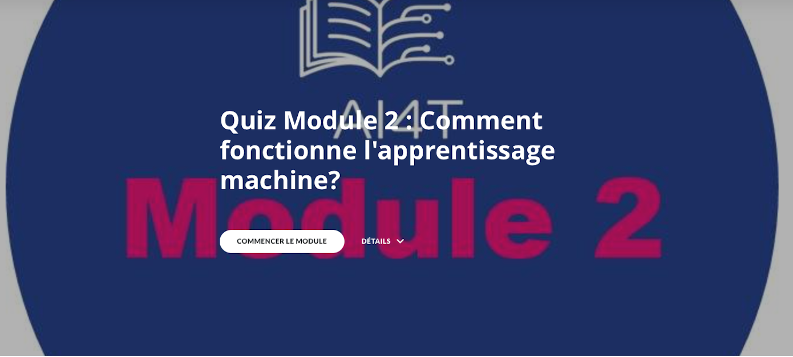

### Quiz Module 2: Des mécanismes en IA

Le Quiz du Module 2 est composé de 3 parties:

- QUIZ 1: Des mécanismes en IA
- QUIZ 2: Méthodes d'apprentissage automatique
- QUIZ 3: Données de l'IA

_Cliquez sur l'image ci-dessous et lancez le quiz !_

{:target="_blank" }
