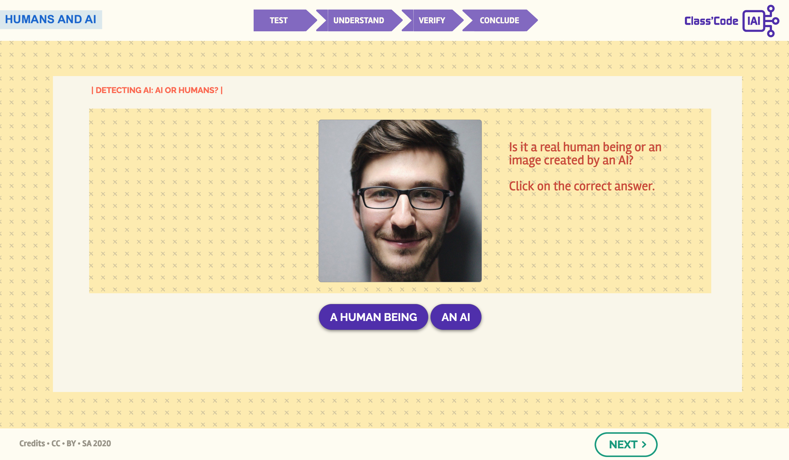

#### Débusquer l'IA: IA ou Humain?

L'activité suivante consiste à identifier si une image est réelle ou produite par une IA. Cette activité expérimentale est une introduction pour comprendre les réseaux antagonistes génératifs ou GANs (Generative Adversarial Networks en anglais).

**Vous voulez essayer?**  
_Cliquez sur l'image ci-dessous et laissez-vous guider!_

{:target="_blank" }
