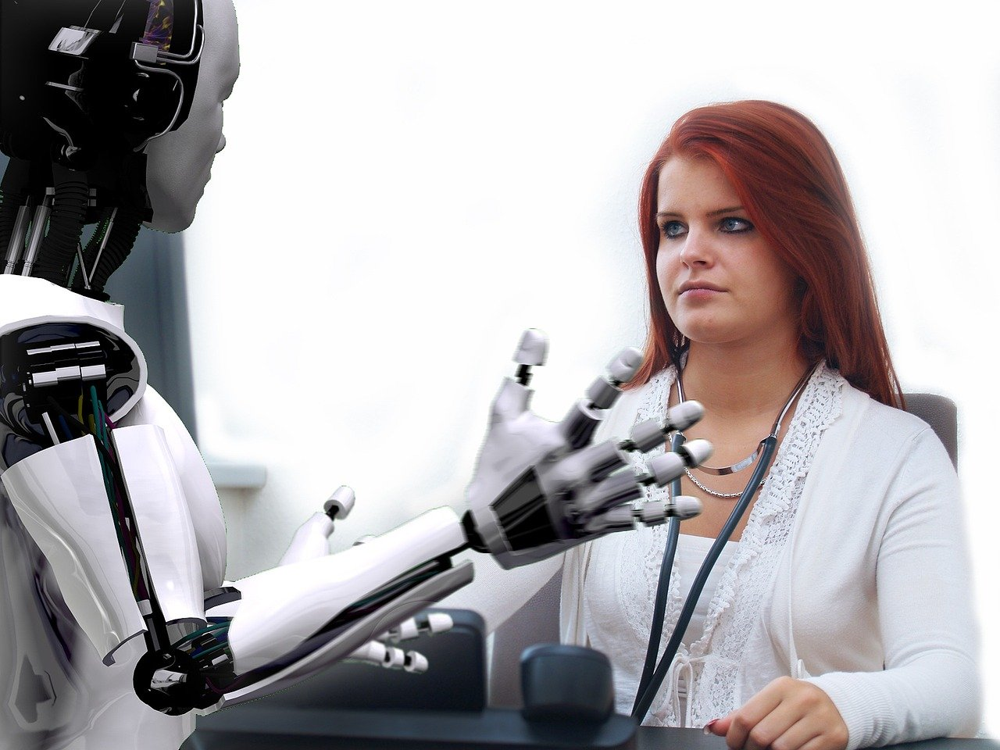

Les révolutions industrielles précédentes ont toujours impacté de façon quasi exclusive la catégorie de travailleurs que l’on appelle "**cols bleus**". À savoir, les métiers impliquant des tâches plutôt manuelles.

A contrario, ceux que l’on appelle les "**cols blancs**",  les actifs qui occupent des emplois de “bureau”, n’ont auparavant jamais été menacés par ces révolutions. La révolution technologique qu’annonce l’IA est à cet égard, bien différente des précédentes. Elle menace en effet autant les cols blancs que les cols bleus. Au palmarès des métiers qui seraient les plus impactés dans les années à venir, on en retrouve non seulement dans des métiers comme la conduite des trains ou le travail aux guichets, mais aussi dans les banques et assurances, dans la comptabilité, dans la bureautique ou dans la direction.

Dans une interview au magazine [Chut magazine](https://chut.media/portraits/erwann-tison-le-numerique-mon-emploi-et-moi/), Erwan Tison, identifie dans son livre "Les robots , mon emploi et moi” plusieurs catégories d’emploi qui, à des degrés différents, pourraient être transformés par l’IA.

[Image by Thomas Meier](https://pixabay.com/users/tmeier1964-2034229/?utm_source=link-attribution&utm_medium=referral&utm_campaign=image&utm_content=1193318) for [Pixabay](https://pixabay.com/?utm_source=link-attribution&utm_medium=referral&utm_campaign=image&utm_content=1193318)

*   Les emplois **physiques**" pourraient être impactés par la robotisation. Les professionnels seraient remplacés par des machines capables d’effectuer des tâches ardues plus vite et plus efficacement qu’eux.

*   Les emplois "**intellectuels**" seraient impactés par la digitalisation. Des algorithmes pourraient effectuer des tâches systématiques, rébarbatives et longues plus rapidement que les humains.

*   Certains professionnels verraient leur quotidien amélioré par des mécanismes d’intelligence artificielle, qui leur permettraient d’être débarrassés de _tâches répétitives_ pour se concentrer sur les aspects les plus importants de leurs métiers.

*   Enfin certains emplois, qui demandent une interaction trop complexe avec l'environnement, ne seraient pas directement menacés. C’est le cas des jardiniers ou des plombiers, entre autres.

**Ces prédictions sont-elles probables et doit-on craindre d’être à terme, remplacés majoritairement par des robots dans notre travail?**

Pour le chercheur et économiste Gregory Verdugo _"Bien malin en vérité qui peut prédire ce qui sera techniquement automatisable"_. On pourrait chercher à automatiser toute notre société, mais ce serait notre choix et il faut se poser la question de la finalité d’un tel choix. Pour le moment, l’IA permet principalement de **faciliter le travail** de certains professionnels, mais à l’avenir cela dépendra de la façon dont nous choisirons collectivement d’organiser la société avec ces nouveaux outils.

Image by [Seanbatty](https://pixabay.com/fr/users/Seanbatty-5097598/?utm_source=link-attribution&utm_medium=referral&utm_campaign=image&utm_content=2228610) from [Pixabay](https://pixabay.com/fr/?utm_source=link-attribution&utm_medium=referral&utm_campaign=image&utm_content=2228610)

Par ailleurs, si l’intelligence artificielle est capable d’apprendre vite, il y a des capacités humaines qui ne pourront qu’être simulées et non réalisées, comme l’empathie et la créativité humaine, par exemple. Or, dans de nombreuses professions, ces deux qualités sont indispensables. Un futur où nos infirmiers/ières, artistes ou éducateurs ressembleraient à R2D2 n’est donc pour le moment pas encore envisageable.
