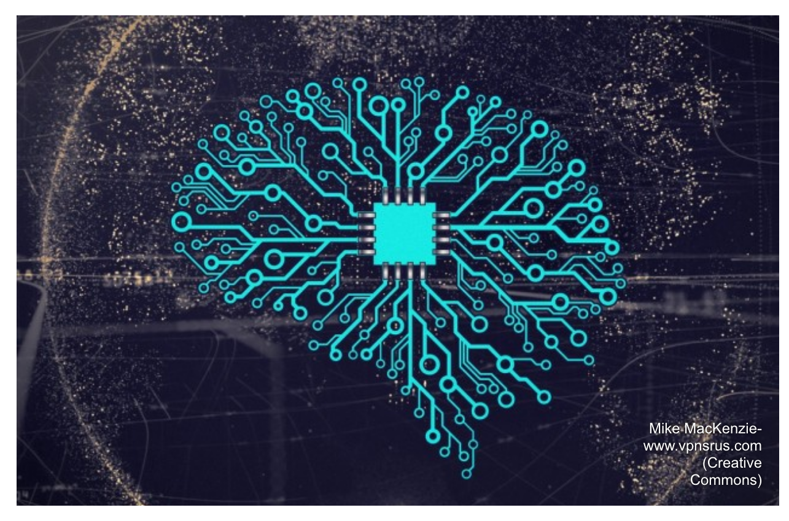

_Lire l'article entier sur [(01net.com)](https://www.01net.com/actualites/intelligence-artificielle-l-apprentissage-automatique-cherche-son-ethique-1712366.html)_

De plus en plus d’algorithmes d’intelligence artificielle commencent à régenter nos vies, sans que l’on soit certain du bien-fondé de leurs décisions. Des bonnes pratiques et des outils commencent à émerger pour favoriser une utilisation éthique et responsable de cette technologie.

Photo by Mike MacKensie from www.vpnsrus.com

WA chaque fois qu’une nouvelle technologie révolutionnaire est apparue, des questions d’ordre éthique et juridique se sont rapidement posées : Quelles sont ses limites d’usage ? Comment s’assurer qu’elle ne provoque pas de conséquences néfastes pour les utilisateurs ? Qui est responsable si quelque chose dérape ?

L’intelligence artificielle n’échappe pas à cette règle. La question de l’éthique est même particulièrement importante étant donné l’impact de cette technologie -et en particulier sa variante de l’apprentissage automatique-, sur des aspects de notre vie quotidienne toujours plus nombreux. Les algorithmes d’intelligence artificielle décident ce que nous voyons sur Internet, évaluent notre solvabilité, copilotent nos avions et nos voitures, nous proposent des produits à acheter, aident les médecins à détecter nos maladies et à nous prescrire des médicaments, peuvent reconnaître notre voix et notre visage à la maison ou ailleurs, etc..
