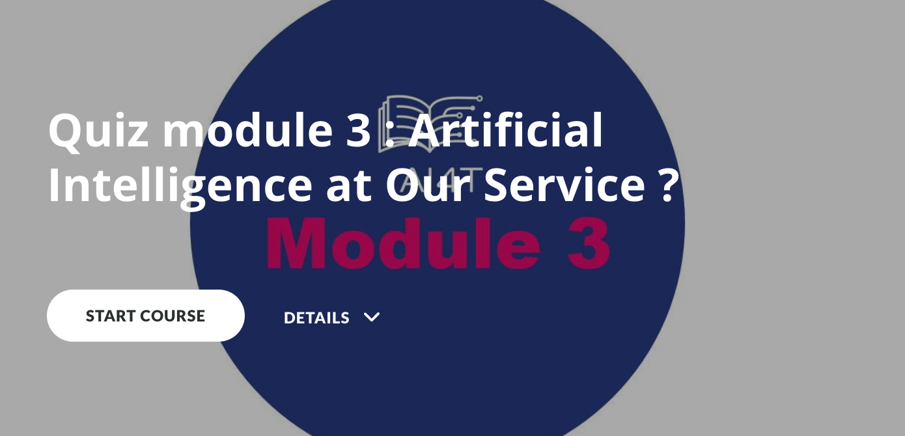

### Quiz Module 3: Humains et IA

Le Quiz du Module 3 est composé de 3 parties:

- QUIZ 1: IA et réseaux neuronaux
- QUIZ 2: Une IA, aide à la décision
- QUIZ 3: Biais et créativité

_Cliquez sur l'image ci-dessous et lancez le quiz !_

{:target="_blank" }
